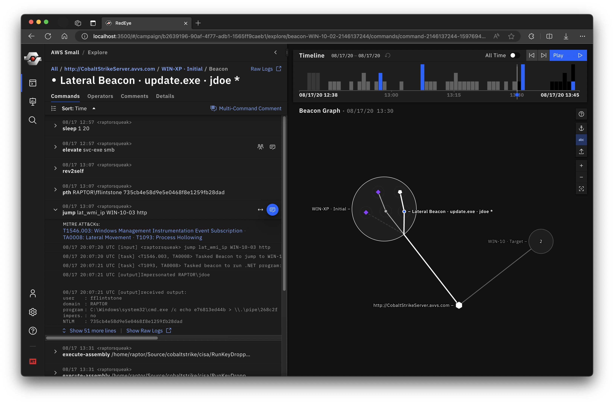

# RedEye 

# RedEye
Red Team C2 Log Visualization



RedEye is a visual analytic tool for supporting Red Team operations, analytics, and reporting.
A critical aspect of Red Team engagements is to communicate to customers how successful breaches unfold so that they can assess mitigation strategies.
Visualizing breaches can be a helpful but time-consuming task. RedEye offers a visualization tool to help Red Teams easily
assess complex data for effective decision-making.

## Getting started

RedEye currently supports uploading [Cobalt Strike](https://www.cobaltstrike.com/) logs and offers two modes:
- The "Red Team" version gives a Red Team the ability to upload campaign logs, explore, and create presentations. This mode is started by running the RedEye with the `SERVER_BLUE_TEAM=false` environment variable or the `--redTeam` argument 
- The "Blue Team" version gives a Blue Team the ability to review a read-only campaign exported by a Red Team. This mode runs by default

### [User Guide](docs/User Guide.md)

## Quick start

The fastest way to get up and running is by downloading the latest `RedEye` binaries for your operating system in the "Releases" tab on GitHub.

Both Blue & Red Team versions can be started from the same `RedEye` application binary. 

### Blue Team

The "Blue Team" version can be run by double-clicking the `RedEye` application binary

`RedEye` runs by default at `http://127.0.0.1:4000` and will automatically open your default browser

If a `campaigns` folder is located in the same directory as the `RedEye` application, RedEye will attempt to import any `.redeye` campaign files within. Campaign files can be exported in the "Red Team" version.

To prepare a version for the Blue Team, follow these two steps:
1. Copy the `RedEye` application binary to an empty folder
2. Create a `campaigns` folder in the same directory and place the `.redeye` campaign files you want to send inside

### Red Team

The "Red Team" version comes in two parts:
    - The `RedEye` application binary
    - The `parsers` folder containing the `cs-parser` Cobalt Strike log parser binary

There are three options to run RedEye:

1. Run the downloaded binary: `AUTHENTICATION_PASSWORD=<your_password> ./RedEye --redTeam`
2. Clone this repository and either: 
   1. Docker Compose:
      1. Update the environment variables in `docker-compose.yml`
      2. Run: `docker-compose -f docker-compose.yml up -d redeye-core`
   2. Install and run the project directly (covered in the [Local Build](#local-build) section)

The application runs by default at `http://127.0.0.1:4000`

## Platform support

- Linux
    - Ubuntu 18 and newer
    - Kali Linux 2020.1 and newer
    - Others may be supported but are untested
- macOS
    - El Capitan and newer
- Windows
    - Windows 7 and newer

ARM support is experimental


## Local Build

### Required Packages

- [Node.js](https://nodejs.org/en/) >= v16

- Install yarn: `npm install -g yarn`
- Run: `yarn install` // Installs all packages
- Run either:
  a. `yarn release:all` to build a binary for Linux, macOS, and Windows
  b. `yarn release --platform (mac|win|linux)` to build for a specific platform.
    - platform options:
      - mac
      - win
      - linux

## Development

### Setup

- Install yarn: `npm install -g yarn`
- Run: `yarn install` // Installs all packages


#### Quick Start Development
Runs the project in development mode

```sh
yarn run start
```

#### Advanced Development
It is recommended to run the server and client in two separate terminals

```sh
yarn run start:client
```

```sh
yarn run start:server
```


#### Build

`yarn build:all` to build all applications and their dependent libraries


#### Server .env example
```env
AUTHENTICATION_PASSWORD=937038570
AUTHENTICATION_SECRET=supertopsecretdonttellanyone
DATABASE_MODE=DEV_PERSIST
SERVER_BLUE_TEAM=false
SERVER_PRODUCTION=false
```

---

<div align="center">

  
  
</div>
