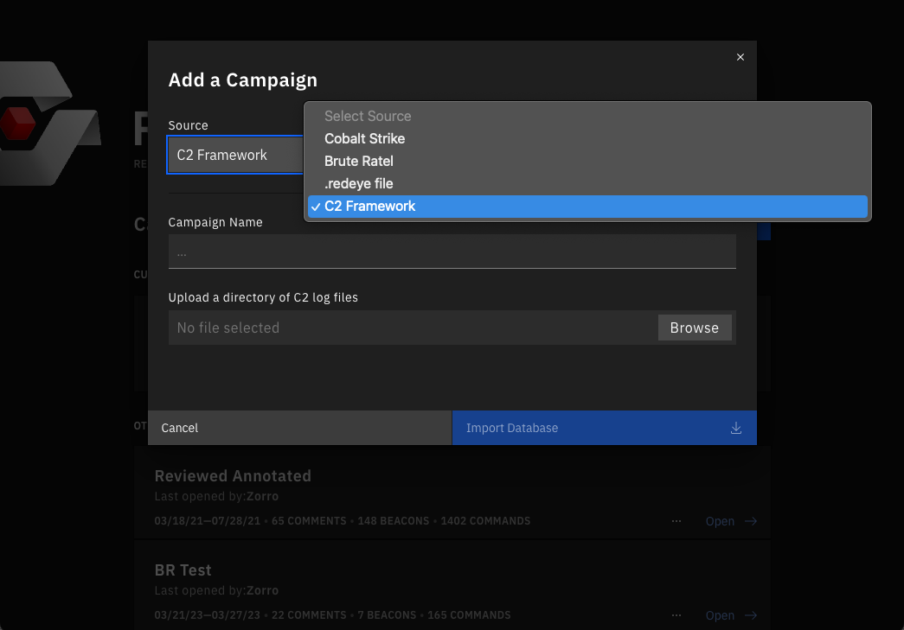

<!-- TOC -->

- [Intro](#intro)
- [Basic Requirements](#basic-requirements)
- [`info`](#info)
- [`parse-campaign`](#parse-campaign)
  - [Parsing a single file](#parsing-a-single-file)
    - [Line 1](#line-1)
    - [Line 2](#line-2)
    - [Line 3 & Output](#line-3--output)
    - [Line 4](#line-4)
    - [Parsing the log file](#parsing-the-log-file)
- [Make Parser Executable](#make-parser-executable)
- [Conclusion](#conclusion)
<!-- TOC -->

# Intro

This is a guide for creating a parser that processes C2 data into a format that RedEye can integrate. A RedEye parser can be written in any programming language, as long as it can be invoked from the command-line and return messages through stdout. In summary, RedEye parsers are standalone command-line programs, placed in the `parsers` folder, and invoked by RedEye.

For this guide, we're going to create a simple parser called `custom-redeye-parser` using NodeJS, but the concepts can be applied to any language. We'll walk you through the process of creating a parser and detail each subcommand that can be implemented to use in RedEye.

# Basic Requirements

A parser must support a very simple set of commands and arguments that will be invoked by RedEye. Most languages have a built-in method for reading command-line arguments, but you can also use a third-party library.

Before we start implementing the first command, we should go over what communication between RedEye and your custom parser looks like.
Communication to the parser happens through command-line arguments only.
The parser communicates back through standard output (stdout) with messages of stringified JSON data.
Here's an example of the communication lifecycle between RedEye and our parser:

Here's a quick overview the communication lifecycle with a parser named `custom-redeye-parser`:

1. On startup, RedEye requests information about the parser using the `custom-redeye-parser info` command
2. A User selects our `custom-redeye-parser` in the RedEye interface and uploads files to be parsed
3. RedEye invokes the parser with a path to the user uploaded files: `custom-redeye-parser parser-campaign --folder </path/to/folder>`
4. The parser processes the files and returns the JSON object (through stdout) with the parsed data
5. RedEye processes the JSON object and stores the data in the database

Messages sent by the parser must always be formatted as: `[<TYPE>] <JSON>\n`. In our example, we're using the `[DATA]` message type, which tells RedEye this is the return data from the command.
You can see more information on all the message types in the [Message Types](#message-types) section.

Now let's get into the first command RedEye will send to your parser.

# `info`

The `info` command _informs_ RedEye on our parsers configuration and customizes our parsers upload form within RedEye's UI. On startup, RedEye will send the `info` command (example: `custom-redeye-parser info`) to each parser it detects (or is configured to use).
The info our parser needs to send includes the parser ID, display name, and upload form configuration. Here's the `info` command implemented for the `custom-redeye-parser` with some comments to explain each property:

```typescript
#!/usr/bin/env node
function info() {
	const message =
		'[DATA] ' + // The start of our message with the DATA message type
		JSON.stringify({
			version: 1, // The version of the RedEye parser config that the parser is compatible with
			id: 'custom-redeye-parser', // ID for parser, should match the name of the binary file or command
			name: 'Custom RedEye Parser', // The display name of the parser

			// Configures the upload form in the RedEye client for the parser
			uploadForm: {
				serverDelineation: 'Database', // How our C2 data is seperated, by folders of files or database/config file
				enabledInBlueTeam: false, // Whether the parser is enabled for Blue Team users
				tabTitle: 'Upload C2 Log Files', // The title of the upload tab
				fileUpload: {
					type: 'Directory', // The type of upload, is it a single file or a directory
					validate: 'None', // How to validate the files uploaded, more on this later
					description: 'Upload a directory of C2 log files', // A description of the upload
				},
				fileDisplay: {
					editable: true, // Whether the user can edit the server names before uploading
				},
			},
		}) +
		'\n'; // End the message with a newline
	process.stdout.write(message);
}

if (process.argv[2] === 'info') {
	// Check if the command is info
	info();
}
```

If you put this code in a file (for the example, we called our file `custom-redeye-parser`), make it executable, and place it in `parsers` folder; You can start RedEye (with "parsers" set to true RedEye's `config.json`) and see our parser available in the upload tab.



Now that we have our parser configured and recognized by RedEye, we can start implementing the `parse-campaign` command.

# `parse-campaign`

The `parse-campaign` command processes the users uploaded files and returns the transformed data to RedEye.
It is invoked with the following command: `custom-redeye-parser parse-campaign --folder </path/to/folder>`.
The `--folder` argument is the path to a folder containing the files we need to parse.
Our parser needs to read those files and transform the data into a network graph that RedEye can ingest.
How you implement this largely depends on what your data looks like, we'll walk through each of the properties in the data structure and show an example of transforming the data into the RedEye format.

Here's an overview of what each property in the data structure represents:

`Servers` are the C2 servers that `Operators` use to send `Commands` to `Beacons`.
`Hosts` are target assets in a network like workstations, laptops, network servers, etc.
`Beacons` are the C2 agents that run on `Hosts` and execute `Commands`.
`Commands` are the actions that `Operators` execute on `Beacons` through `Servers`.
`Links` are the connections from `Servers` to `Beacons` and `Beacons` to `Beacons`.
`Operators` are the drivers of action, they initiate `Commands` through `Servers` that `Beacons` run on `Hosts`.

And this is the relationship between each property:

- `Operators` are standalone entities referenced by the `Commands` they execute.
- `Servers` are the starting point of our network graph.
  - `Hosts` are assigned to the first `Server` that establishes a connection,
  - `Beacons` are assigned to `Hosts`,
  - `Commands` are assigned to `Beacons`.
  - `Links` connect `Servers` to `Beacons` and `Beacons` to `Beacons`.

Here is the JSON structure that RedEye expects:

```typescript
interface ParserOutput {
	servers: { [server: string]: ParserServer };
	hosts: { [host: string]: ParserHost };
	beacons: { [beacon: string]: ParserBeacon };
	operators: { [operator: string]: ParserOperator };
	commands: { [command: string]: ParserCommand };
	links: { [link: string]: ParserLink };
}
```

For an in-depth explanation of each property, check out the [Commands API Guide](./commands-api/parse-campaign/index.md)

## Parsing a single file

To make this easier to understand, we'll start by parsing a single database/json file and transforming it into the RedEye data structure.
This example data file is an ideal format for RedEye, not all C2 log files will be this easy to parse, but it's to focus on how RedEye's data structure works rather than understanding a log format.

Let's start by parsing a single file and transforming it into the RedEye data structure.
For this example, we'll fabricate a simplified C2 log file called `c2-log-files.txt`:

```
2023-08-17T19:37:41 [INIT] <thor> server - name: server1; type: https;
2023-08-17T19:38:41 [INIT] <thor> beacon - name: beacon1; from: server1; procces: explorer.exe; pid: 1234; port: 443; - on: host1; ip: 192.168.23.1; os: Windows 10.0.19041;
2023-08-17T19:39:41 [COMMAND] <thor> beacon1 - mitre: T1057 - ps
2023-08-17T19:40:11 [OUTPUT]
***
[System Process]	0	0
System	0	4
Registry	4	68
smss.exe	4	268
***
2023-08-17T19:44:23 [INIT] <thor> beacon - name: beacon2; from: beacon1; procces: notepad.exe; pid: 3456; port: 443; - on: host1; ip: 192.168.23.1; os: Windows 10.0.19041;
```

Let break this down into how it maps to the RedEye data structure:

#### Line 1

`2023-08-17T19:37:41 [INIT] <thor> server - name: server1; type: https;`

Here's the information we can extract from this line:

- The timestamp of the event: `2023-08-17T19:37:41`
- This event is initializing a C2 entity: `INIT`
- The operator of the event: `thor`
- The type of C2 entity: `server`
- Finally, the name and type of the server: `server1` & `https`

And formatted for RedEye:

```json
{
	"servers": {
		"server1": {
			"name": "server1",
			"type": "https"
		}
	},
	"operators": {
		"thor": {
			"name": "thor"
		}
	}
}
```

### Line 2

`2023-08-17T19:38:41 [INIT] <thor> beacon - name: beacon1; from: server1; procces: explorer.exe; pid: 1234; port: 443; - on: host1; ip: 192.168.23.1; os: Windows 10.0.19041;`

Here's the information we can extract from this line:

- The timestamp of the event: `2023-08-17T19:38:41`
- This event is initializing a C2 entity: `INIT`
- The operator of the event: `thor`
- The type of C2 entity: `beacon`
- The name of the beacon: `beacon1`
- The server the beacon is connected to: `server1`
- The process name and PID of the beacon: `explorer.exe` & `1234`
- The port the beacon is connected to: `443`
- The host the beacon is running on: `host1`
- The IP, OS, and OS version of the host: `192.168.23.1` & `Windows` & `10.0.19041`

And all the new information formatted for RedEye:

```json
{
	"hosts": {
		"host1": {
			"name": "host1",
			"ip": "",
			"os": "Windows",
			"osVersion": "10.0.19041"
		}
	},
	"beacons": {
		"beacon1": {
			"name": "beacon1",
			"process": "explorer.exe",
			"pid": "1234",
			"port": "443",
			"host": "host1",
			"server": "server1"
		}
	},
	"links": {
		"server1-beacon1": {
			"from": "server1",
			"to": "beacon1"
		}
	}
}
```

### Line 3 & Output

```
2023-08-17T19:39:41 [COMMAND] <thor> beacon1 - mitre: T1057 -> ps
2023-08-17T19:40:11 [OUTPUT]
***
[System Process]	0	0
System	0	4
Registry	4	68
smss.exe	4	268
***
```

Here's the information we can extract from these lines:
COMMAND

- The timestamp of the command event: `2023-08-17T19:39:41`
- This event is a command: `COMMAND`
- The operator of the event: `thor`
- The beacon the command is being sent to: `beacon1`
- The MITRE ATT&CK technique being executed: `T1057`
- The command being executed: `ps`
  OUTPUT
- The timestamp of the output event: `2023-08-17T19:40:11`
- This event is output from a command: `OUTPUT`
- The beacon the output is from: `beacon1`
- The output of the command between the `***` delimiters

And all the new information formatted for RedEye:

```
{
	"commands": {
		"ps-beacon1-17-08-23 19:39:41": {
			"attackIds": ["T1057"],
			"input": {
				"blob": "ps",
				"dateTime": "17-08-23 19:39:41",
				"logType": "BEACON",
				"filePath": "<folder-with-log-files>/c2-log-files.txt",
				"lineNumber": "3"
			},
			"output": {
				"blob": "[System Process]	0	0\nSystem	0	4\nRegistry	4	68\nsmss.exe	4	268\n",
				"dateTime": "17-08-23 19:40:11",
				"logType": "BEACON",
				"filePath": "<folder-with-log-files>/c2-log-files.txt",
				"lineNumber": "4"
			},
			"beacon": "beacon1",
			"operator": "thor",
			"timestamp": "17-08-23 19:39:41"
		}
	}
}
```

### Line 4

`2023-08-17T19:44:23 [INIT] <thor> beacon - name: beacon2; from: beacon1; procces: notepad.exe; pid: 3456; port: 443; - on: host1; ip: 192.168.23.1; os: Windows 10.0.19041;`

Here's the information we can extract from this line:

- The timestamp of the event: `2023-08-17T19:44:23`
- This event is initializing a C2 entity: `INIT`
- The operator of the event: `thor`
- The type of C2 entity: `beacon`
- The name of the beacon: `beacon2`
- The beacon the beacon is connected to: `beacon1`
- The process name and PID of the beacon: `notepad.exe` & `3456`
- The port the beacon is connected to: `443`
- The host the beacon is running on: `host1`
- The IP, OS, and OS version of the host: `192.168.23.1` & `Windows` & `10.0.19041`

And all the new information formatted for RedEye:

```json5
{
	beacons: {
		// ...
		beacon2: {
			name: 'beacon2',
			process: 'notepad.exe',
			pid: '3456',
			port: '443',
			host: 'host1',
			server: 'server1',
		},
	},
	links: {
		// ...
		'beacon1-beacon2': {
			from: 'beacon1',
			to: 'beacon2',
		},
	},
}
```

Here is the final data structure for our example:

```json5
{
	servers: {
		server1: {
			name: 'server1',
			type: 'https',
		},
	},
	hosts: {
		host1: {
			name: 'host1',
			ip: '192.168.23.1',
			os: 'Windows',
			osVersion: '10.0.19041',
		},
	},
	beacons: {
		beacon1: {
			name: 'beacon1',
			process: 'explorer.exe',
			pid: '1234',
			port: '443',
			host: 'host1',
			server: 'server1',
			commands: ['ps'],
		},
		beacon2: {
			name: 'beacon2',
			process: 'notepad.exe',
			pid: '3456',
			port: '443',
			host: 'host1',
			server: 'server1',
		},
	},
	operators: {
		thor: {
			name: 'thor',
		},
	},
	links: {
		'server1-beacon1': {
			from: 'server1',
			to: 'beacon1',
		},
		'beacon1-beacon2': {
			from: 'beacon1',
			to: 'beacon2',
		},
	},
	commands: {
		'ps-beacon1-17-08-23 19:39:41': {
			attackIds: ['T1057'],
			input: {
				blob: 'ps',
				dateTime: '17-08-23 19:39:41',
				logType: 'BEACON',
				filePath: '<folder-with-log-files>/c2-log-files.txt',
				lineNumber: '3',
			},
			beacon: 'beacon1',
			operator: 'thor',
			timestamp: '17-08-23 19:39:41',
		},
	},
}
```

### Parsing the log file

Now that we've gone over how to identify what data to extract and how to format it for RedEye. Let's update the previous file we created and add the following code:

```typescript
#!/usr/bin/env node
import fileSystem from 'fs';

function parseLogFile() {
	const logPath = process.argv[4].replaceAll('"', ''); // Get the path and remove the quotes around it
	const logFile = fileSystem.readFileSync(`${logPath}/c2-log-files.txt`, 'utf8'); // Read the log file from the path passed in the command
	const lines = logFile.split('\n'); // Split the log file into lines
	const output = {
		// Create an empty object to store our output
		servers: {},
		hosts: {},
		beacons: {},
		operators: {},
		commands: {},
		links: {},
	};

	const totalLines = lines.length;
	while (lines.length > 0) {
		// Iterate over each line in the log file
		const line = lines.shift(); // Get the first line in the log file
		if (!line.length) {
			break; // If the line is empty, break out of the loop
		}
		const [messageInfo, ...message] = line.split(' - '); // Split the line into its parts
		const [timestamp, type, operatorItem, source] = messageInfo.split(' '); // Split the line into its parts
		const operator = operatorItem.replace('<', '').replace('>', ''); // Get the operator name
		if (type === '[INIT]') {
			// Check if the line is an INIT message
			const properties = getProperties(message[0]);

			if (source === 'server') {
				output.servers[properties.name] = {
					// Create a new server object
					name: properties.name,
					type: properties.type,
				};
			}

			if (source === 'beacon') {
				const hostProperties = getProperties(message[1]);
				output.beacons[properties.name] = {
					// Create a new beacon object
					name: properties.name,
					host: hostProperties.on,
					process: properties.process,
					processId: properties.pid,
					port: properties.port,
					server: properties.server,
				};
				output.links[`${properties.name}-${properties.from}`] = {
					// Create a new link object
					source: properties.name,
					target: properties.from,
				};
				if (!output.hosts[hostProperties.on]) {
					const [os, osVersion] = hostProperties.os.split(' '); // Get the os and os version of the host
					output.hosts[hostProperties.on] = {
						name: hostProperties.on,
						ip: hostProperties.ip,
						os: os,
						osVersion: osVersion,
					};
				}
			}
		}
		if (type === '[COMMAND]') {
			// Check if the line is a COMMAND message
			const [commandProps, command] = message;
			const properties = getProperties(commandProps);
			const inputLineNumber = totalLines - lines.length;

			// Get the command output
			let commandOutput = '';

			const [commandOutputTimestamp] = lines.shift().split(' ');
			lines.shift(); // Move past starting *** line
			while (lines[0] !== '***') {
				commandOutput += lines.shift() + '\n';
			}
			lines.shift(); // Move past ending *** line
			const outputLineNumber = totalLines - lines.length;

			// Create a new command object
			output.commands[`${command}-${source}-${timestamp}`] = {
				// Create a new command object
				attackIds: properties.mitre.split(','),
				input: {
					blob: command,
					dateTime: timestamp,
					logType: 'BEACON',
					lineType: 'INPUT',
					filePath: process.argv[4],
					lineNumber: inputLineNumber,
				},
				output: {
					blob: commandOutput,
					dateTime: commandOutputTimestamp,
					logType: 'BEACON',
					lineType: 'OUTPUT',
					filePath: process.argv[4],
					lineNumber: outputLineNumber,
				},
				beacon: source,
				operator: operator,
			};
		}
	}

	const message =
		'[DATA] ' + // The start of our message with the DATA message type
		JSON.stringify(output); // The output object as a JSON string
	+'\n'; // A new line character to end the message

	process.stdout.write(message); // Write the message to stdout
}

function getProperties(message) {
	const properties = {};

	for (const property of message.split('; ')) {
		// Iterate over each property in the message
		const [key, value] = property.split(': '); // Split the property into its parts
		properties[key] = value; // Add the property to the properties object
	}

	return properties;
}

if (process.argv[2] === 'info') {
	// Check if the command is info
	info();
} else if (process.argv[2] === 'parse-campaign') {
	// Check if the command is 'parse-campaign'
	parseLogFile();
}
```

You now have a fully functioning parser that can be integrated into RedEye!

# Make Parser Executable

The final step is to make your parser executable and add it to the `parsers` folder in the RedEye directory. RedEye will automatically detect the parser if the `parsers` option in `config.json` is set to true.

# Conclusion

In this guide, we went over what a custom RedEye parser is, went over how to implement the `info` command, and implemented a log parser for the `parse-campaign` command. We look forward to seeing what you create!
